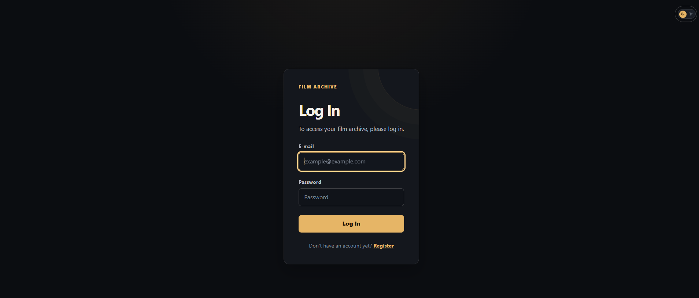
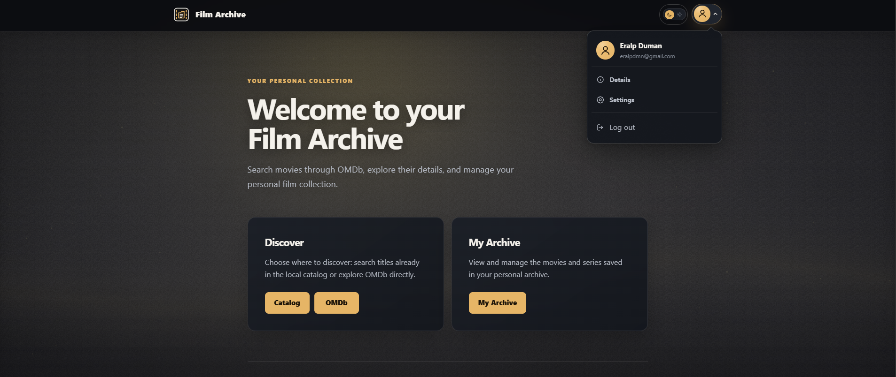
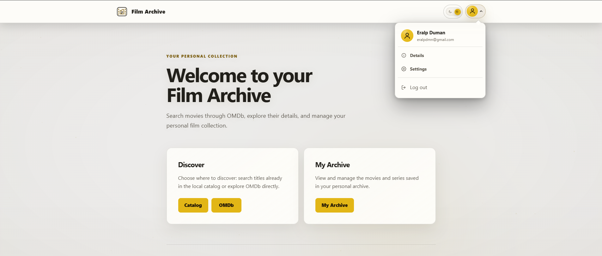
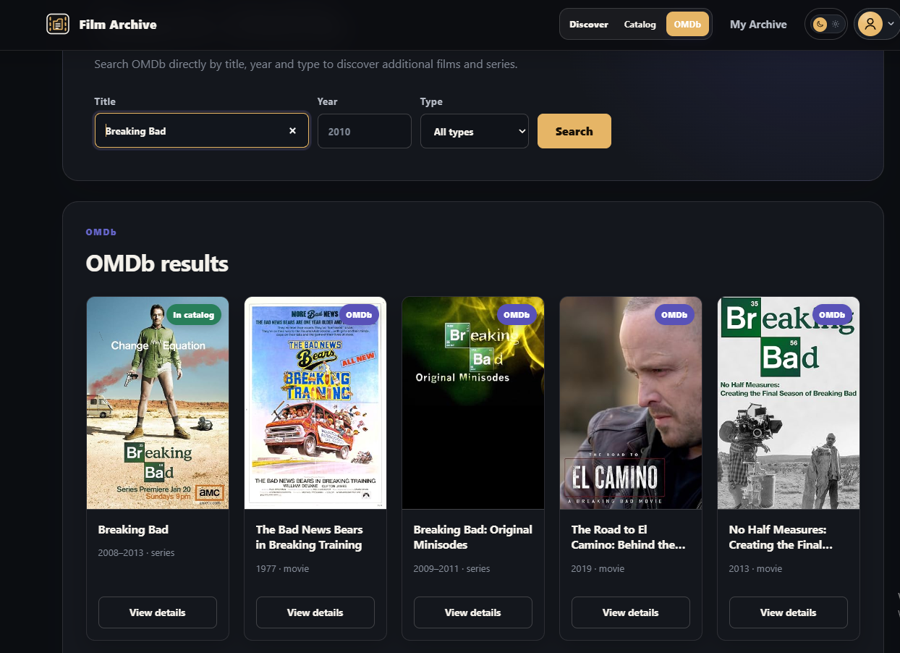
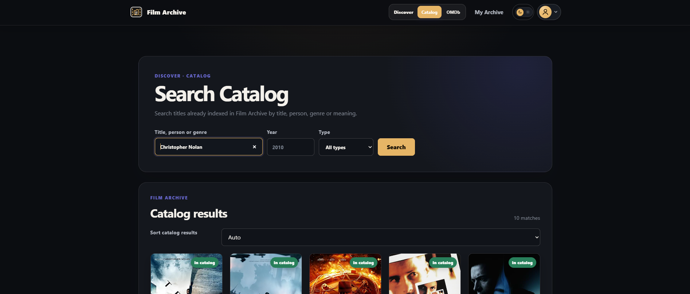
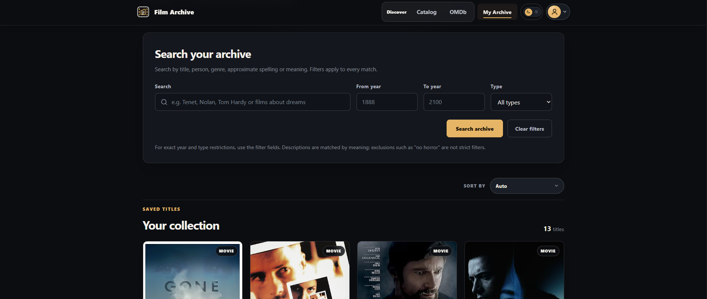
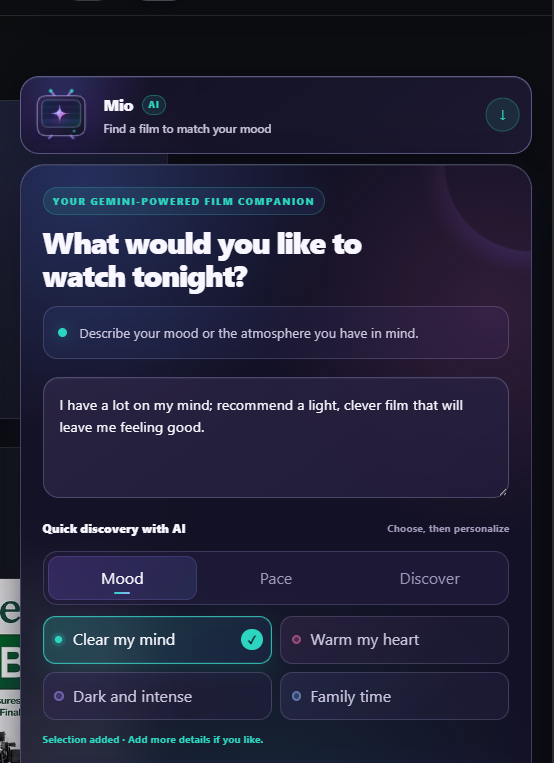
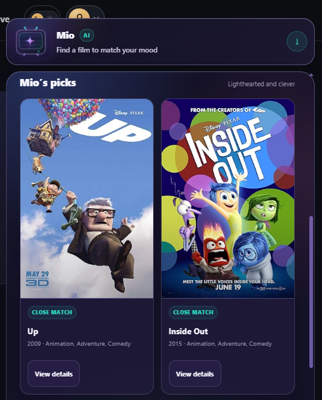
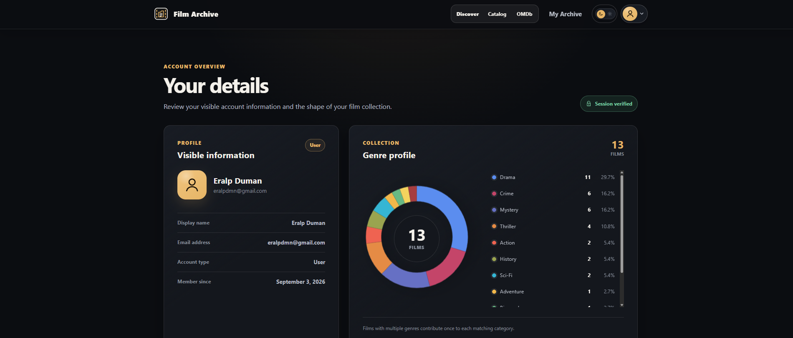

# Film Access

Film Access is a Spring Boot web application for discovering films, building a personal archive, and receiving AI-assisted recommendations. It combines OMDb film data with a local PostgreSQL catalog, `pgvector` similarity search, fuzzy text matching, and a Gemini-powered natural-language assistant named Mio.

## Features

- Email and password registration and authentication
- OMDb search and detailed film pages
- A local film catalog with filters, sorting, and pagination
- Personal archives with add, remove, filter, sort, and pagination operations
- Hybrid search across titles, genres, actors, directors, spelling variants, and meaning
- Personalized home-page recommendations based on a user's saved films
- Mio, a Gemini-powered natural-language film assistant
- Optional Redis caching for query embeddings
- An administrator dashboard with XLSX user/archive export
- Versioned database migrations with Flyway
- Role-based authorization, CSRF protection, and password hashing

## Technology stack

- Java 21
- Spring Boot 4.1.0 and Spring AI 2.0.0
- Spring MVC, Thymeleaf, Spring Security, and Spring Data JPA
- PostgreSQL 17 with pgvector, `pg_trgm`, and `fuzzystrmatch`
- Redis 7.4 as an optional cache
- Flyway database migrations
- JUnit, AssertJ, Mockito, and Testcontainers
- Docker Compose and GitHub Actions

## Prerequisites

- JDK 21
- Docker Desktop, or Docker Engine with Docker Compose
- API keys for OMDb, OpenAI, and Google Gemini

You do not need a system-wide Maven installation. The repository includes Maven Wrapper scripts for Windows, Linux, and macOS.

## Quick start

1. Clone the repository and enter the project directory.
2. Create your local environment file from the committed template.

   Windows PowerShell:

   ```powershell
   Copy-Item .env.example .env
   ```

   Linux/macOS:

   ```bash
   cp .env.example .env
   ```

3. Replace the placeholder API keys and database password in `.env`.
4. Start the pgvector-enabled PostgreSQL service.

   ```bash
   docker compose up -d postgres
   ```

5. Run the application.

   Windows:

   ```powershell
   .\dev.ps1
   ```

   Linux/macOS:

   ```bash
   ./mvnw spring-boot:run
   ```

6. Open [http://localhost:8080](http://localhost:8080).

`dev.ps1` activates the `dev` profile and compiles saved source changes while the server runs. Spring Boot DevTools then restarts the running application after Java class changes. Templates, CSS, and JavaScript are read directly from `src/main/resources`, so refresh the browser to see those edits. Compiler errors are written to `target/dev-compile.log`. For a one-off run without automatic compilation, use `.\mvnw.cmd spring-boot:run`.

Flyway applies the database migrations automatically when the application starts. The database name in `DATABASE_URL` must match `POSTGRES_DB`.

## API key setup

All API keys are loaded server-side from `.env` through `spring.config.import`. They must never be placed in Java source files, templates, browser-side JavaScript, screenshots, or commits.

### OMDb

1. Request an API key from the [OMDb API key page](https://www.omdbapi.com/apikey.aspx).
2. Add it to `.env`:

   ```dotenv
   OMDB_API_KEY=your-real-omdb-api-key
   ```

The application uses this key for remote film searches and for retrieving complete film metadata before a title is stored in the local catalog or archive.

### OpenAI

1. Create an API key in the [OpenAI platform](https://platform.openai.com/api-keys).
2. Ensure the associated project has API access and sufficient usage quota.
3. Add the key to `.env`:

   ```dotenv
   OPENAI_API_KEY=your-real-openai-api-key
   ```

OpenAI is used only for embeddings. The configured model is `text-embedding-3-small` with 1,536 dimensions. It powers semantic archive/catalog search and film similarity features; it is not used for Mio's conversational interpretation.

### Google Gemini

1. Create or view a key in [Google AI Studio](https://aistudio.google.com/app/apikey). New deployments should use a key type supported by the current Gemini API requirements.
2. Restrict and protect the key according to the [official Gemini API key guidance](https://ai.google.dev/gemini-api/docs/api-key).
3. Add it to `.env`:

   ```dotenv
   GEMINI_API_KEY=your-real-gemini-api-key
   ```

Gemini is used by Mio to interpret natural-language film requests. The configured chat model is `gemini-3.5-flash-lite`. The application does not enable Google Search retrieval for these requests.

After changing any key, restart the Spring Boot process. If a key has ever been committed, pasted into a public issue, or shared in logs, revoke it and create a replacement; deleting it from the latest commit alone does not remove it from Git history.

## Environment variables

The committed [.env.example](.env.example) contains safe placeholders and working local defaults. Copy it to `.env`, then edit only the local copy.

| Variable | Required | Default | Purpose |
| --- | --- | --- | --- |
| `OMDB_API_KEY` | Yes | — | OMDb search and film metadata |
| `OPENAI_API_KEY` | Yes | — | Film and query embeddings |
| `GEMINI_API_KEY` | Yes | — | Mio natural-language interpretation |
| `POSTGRES_DB` | Yes | `film_archive` in the example | Database created by Docker Compose |
| `POSTGRES_USER` | Yes | `filmApp` in the example | PostgreSQL username used by Docker and Spring |
| `POSTGRES_PASSWORD` | Yes | — | PostgreSQL password used by Docker and Spring |
| `DATABASE_URL` | Yes | `jdbc:postgresql://localhost:5432/film_archive` | JDBC connection URL |
| `SEMANTIC_BACKFILL_ON_STARTUP` | No | `false` | Index missing or stale film embeddings at startup |
| `SEMANTIC_EMBEDDING_BATCH_SIZE` | No | `64` | Number of films sent in an embedding batch |
| `REDIS_QUERY_CACHE_ENABLED` | No | `false` | Enable the shared Redis query-embedding cache |
| `REDIS_URL` | No | `redis://127.0.0.1:6380` | Redis connection URL |
| `ARCHIVE_SEARCH_SPELLING_CANDIDATES` | No | `200` | Maximum fuzzy-search candidate pool |
| `ARCHIVE_SEARCH_REPAIR_ENABLED` | No | `true` | Repair missing embeddings for saved films in the background |
| `CATALOG_REFRESH_ON_STARTUP` | No | `false` | Refresh existing catalog metadata on startup |
| `CATALOG_METADATA_REFRESH_ENABLED` | No | `true` | Enable background metadata maintenance |
| `CATALOG_BOOTSTRAP_ENABLED` | No | `true` | Allow Mio's empty-result flow to trigger catalog import |

Spring configuration also accepts ordinary environment variables supplied by a hosting platform. In production, set these values with the platform's secret manager instead of uploading a `.env` file.

## Semantic and hybrid search

### How film indexing works

For each film, the application builds embedding input from the available title, year, type, genres, director, actors, and plot. OpenAI converts that text into a 1,536-dimensional vector. PostgreSQL stores the vector together with the embedding model name and a hash of the source content.

The hash allows the application to detect stale embeddings when searchable metadata changes. A stored vector is considered current only when its model and content hash match the active configuration.

The required PostgreSQL extensions and indexes are created through Flyway migrations. Use the supplied `pgvector/pgvector` Docker image; a plain PostgreSQL image does not include the required vector extension.

### How a search is evaluated

Archive and catalog search can combine several signals:

- Exact and partial title matches
- Actor and director matches
- Normalized genre matches
- PostgreSQL trigram and Levenshtein spelling similarity
- Cosine similarity between the query embedding and current film embeddings
- Explicit year and film-type filters

Lexical and semantic rankings are merged into a hybrid result set. A result can therefore be found by its exact metadata, an approximate spelling such as a mistyped title, or a descriptive query such as `slow science-fiction films about memory`.

The default semantic similarity threshold is `0.35`, the fuzzy threshold is `0.35`, and an embedding provider call has a four-second timeout. These values are configured in `src/main/resources/application.properties` and should be calibrated with representative production queries before being changed.

### Initial indexing and backfill

New or refreshed films are queued for embedding maintenance. To index existing films immediately on the next application start, temporarily set:

```dotenv
SEMANTIC_BACKFILL_ON_STARTUP=true
SEMANTIC_EMBEDDING_BATCH_SIZE=64
```

Start the application, wait for the backfill to finish, and then return `SEMANTIC_BACKFILL_ON_STARTUP` to `false` so every restart does not perform the same startup scan. Embedding requests consume OpenAI API quota.

Saved films can also be repaired by the background archive repair worker when `ARCHIVE_SEARCH_REPAIR_ENABLED=true`. The repair path updates saved films only; an archive search does not import unrelated catalog titles.

### Degraded behavior

Semantic search is designed to fail softly. If OpenAI is unavailable, times out, or rejects the key, the application continues with title, person, genre, and approximate-spelling matches and displays a notice that semantic results are unavailable or incomplete. Films without a current embedding remain eligible for non-semantic matches.

### Query embedding caches

Successful query embeddings are cached in memory for 15 minutes, with a default maximum of 512 entries. Concurrent requests for the same query share one provider call. Failed embeddings are not cached, and provider failures trigger a short cooldown.

Redis can be enabled as a best-effort shared second-level cache:

```bash
docker compose --profile cache up -d redis
```

Then update `.env`:

```dotenv
REDIS_QUERY_CACHE_ENABLED=true
REDIS_URL=redis://127.0.0.1:6380
```

The Redis cache stores only serialized query vectors with expiration metadata. It does not store film result lists, user records, credentials, or failed embeddings. If Redis becomes unavailable, search falls back to the in-process cache and continues operating.

## Mio and catalog bootstrap

Mio sends the user's natural-language request to Gemini and uses the interpreted intent to select local film candidates. If Mio returns an empty result and catalog bootstrap is enabled, the HTTP response is completed first and a background catalog import may start afterward.

The importer reads a local IMDb `title.basics.tsv.gz` dataset and ranks eligible films using IMDb ratings data. The `film-data` directory is intentionally excluded from Git. Dataset paths, limits, delays, retry behavior, and operational details are documented in [film-catalog-bootstrap.md](film-catalog-bootstrap.md).

## Running tests

Some integration tests start temporary PostgreSQL/pgvector and Redis containers through Testcontainers. Docker must be running.

Run the complete build and verification suite:

Windows:

```powershell
.\mvnw.cmd -B clean verify
```

Linux/macOS:

```bash
./mvnw -B clean verify
```

Run a single test class:

```powershell
.\mvnw.cmd -B "-Dtest=UserFilmRepositoryTest" test
```

Tests use temporary containers and mocked provider clients where appropriate. They do not require real OMDb, OpenAI, or Gemini keys.

## Continuous integration

The GitHub Actions workflow in `.github/workflows/maven.yml` runs for pushes to `main` and pull requests targeting `main`. It:

1. Checks out the repository.
2. Installs Temurin JDK 21 and restores the Maven dependency cache.
3. Makes the Unix Maven Wrapper executable.
4. Runs `./mvnw -B clean verify` once to compile, test, and package the application.

Testcontainers uses Docker on the GitHub-hosted Ubuntu runner. No persistent CI database or external-provider API secrets are required for the test suite.

## Project structure

```text
src/main/java/com/example/
├── admin/       Admin dashboard and Excel exports
├── archive/     Personal archive, filtering, and hybrid search
├── buddy/       Mio recommendation flow
├── film/        Local catalog and maintenance jobs
├── home/        Personalized home-page recommendations
├── omdb/        OMDb client and film details
├── search/      Embedding, semantic search, and caches
└── user/        Registration, authentication, profile, and settings

src/main/resources/
├── db/migration/  Flyway migrations
├── static/        CSS and JavaScript
└── templates/     Thymeleaf templates
```

## Security

- `/register`, `/login`, and static assets are public; other application routes require authentication.
- `/admin/**` requires the `ADMIN` role.
- Spring Security CSRF protection is active for state-changing form submissions.
- Passwords are hashed before persistence.
- Responses deny framing with `X-Frame-Options: DENY`.
- API keys remain server-side and `.env` is excluded by `.gitignore`.

For production, use unique database credentials, HTTPS, restricted provider keys, and your deployment platform's secret-management facility.

## Troubleshooting

- **The application cannot connect to PostgreSQL:** confirm that `docker compose ps` reports a healthy `postgres` service and that `DATABASE_URL`, `POSTGRES_DB`, `POSTGRES_USER`, and `POSTGRES_PASSWORD` agree.
- **A migration reports that `vector` is unavailable:** use the supplied pgvector image instead of plain PostgreSQL.
- **Semantic results are missing:** verify `OPENAI_API_KEY`, provider quota, and whether the relevant films have current embeddings. Run a one-time startup backfill if needed.
- **Mio cannot interpret a request:** verify `GEMINI_API_KEY`, key restrictions, model access, and quota.
- **Remote film search fails:** verify `OMDB_API_KEY` and OMDb usage limits.
- **Redis warnings appear:** Redis is optional. Disable `REDIS_QUERY_CACHE_ENABLED` or start the cache profile; lexical and semantic search can continue without Redis.
- **Testcontainers cannot start:** start Docker and confirm the current user can access the Docker daemon.

## Walkthrough: from first sign-in to your film profile

Follow this path through the application:

**Log in → Home → OMDb search → Catalog → My Archive → Mio → Your details**

### 1. Log in

Enter the email address and password for your account, then select **Log In**. New visitors can use **Register** to create an account first. After authentication, the home page opens with the main discovery and archive shortcuts.



### 2. Explore the home page in night and day mode

The home page gives you two starting points: **Discover** opens the Catalog or OMDb search, while **My Archive** opens your saved collection. Use the switch in the upper-right corner to choose the appearance that is most comfortable for you. The account menu beside it provides access to **Details**, **Settings**, and **Log out**.

| Night mode | Day mode |
| :---: | :---: |
|  |  |
| A dark canvas with warm gold accents keeps the film cards and actions in focus. | A light canvas retains the same layout and actions with brighter contrast. |

### 3. Search OMDb for a film or series

Choose **OMDb** from the home page or the Discover navigation. Search by **title**, and optionally narrow the request by **year** and **type**. The results show posters, titles, years, and whether a title is already in the local catalog. Select **View details** to inspect a result before adding it to your archive. Searching OMDb alone does not save a title to your collection.



### 4. Browse the local catalog

Choose **Catalog** to explore titles already indexed by Film Archive. Its search accepts a title, person, genre, or descriptive phrase; year and type can narrow the results. The result area includes sorting and pagination when applicable. Use **View details** on a catalog card to open the film page and decide whether to add it to your archive.



### 5. Build and manage My Archive

Open a film's **View details** page and select **Add to My Archive** to save it. Saved titles then appear under **My Archive**, where you can search your own collection, filter by year or type, change the sort order, and move between pages. Each archive card offers **View details** for the full film information and **Remove** for deletion; removal asks for confirmation before the title leaves your collection.



### 6. Ask Mio for a recommendation

**Start with a request.** Open Mio from the discovery page and describe the mood or kind of film you want. You can write a full sentence and use the quick choices for mood, pace, or discovery to refine it. In the example below, the request asks for a light, clever film that leaves the viewer feeling good.



**Review Mio's picks.** Mio interprets the request and presents matching films from the catalog. The result cards show posters, basic film information, and a **View details** action, so you can examine a recommendation before saving it. The example response suggests *Up* and *Inside Out*.



### 7. See your account details

Select the account icon in the header, then **Details**. This page shows your display name, email address, account type, and membership date alongside a summary of your saved films. The genre chart breaks down the collection by genre tags; a film with multiple genres contributes to each matching category, so the chart describes genre distribution rather than a count of unique films per slice.



## Final thoughts

Film Access brings together film discovery, a personal archive, and AI-assisted recommendations in one application. The interface makes those features easy to explore, while the backend handles the harder work: validating requests, retrieving film data, storing and searching it, protecting accounts, and responding sensibly when an external service is unavailable.

### Technologies in practice

| Area | Technologies | Role in the project |
| --- | --- | --- |
| Application and pages | Java 21, Spring Boot, Spring MVC, Thymeleaf, CSS, JavaScript | Serve the application and connect user actions to backend features. |
| Accounts and data | Spring Security, Spring Data JPA, PostgreSQL, Flyway | Authenticate users, persist films and archives, and evolve the database schema. |
| Discovery and recommendations | OMDb, Spring AI, OpenAI embeddings, Google Gemini | Fetch film metadata, support meaning-based search, and interpret requests to Mio. |
| Search performance | `pgvector`, `pg_trgm`, `fuzzystrmatch`, optional Redis | Combine vector similarity, approximate text matching, and query caching. |
| Development and verification | Maven, Docker Compose, JUnit, Mockito, Testcontainers, GitHub Actions | Run the local services, test the application, and verify changes in CI. |

### What building the raw backend taught me

By **raw backend**,I built the application's own request, data, and search flows instead of leaning on a ready-made backend service. Spring Boot gave me the foundation, but the real decisions were mine: how a film moves from OMDb into the catalog, how a saved film belongs to a user, how search results get ranked, what happens when an API call or an embedding request fails.

Working through those decisions taught me more than I expected. I picked up practical skills in database design, security, external API integration, async maintenance jobs, caching, and testing that actually checks behavior across components — not just isolated units. But the bigger shift was in how I think about a backend now. A feature isn't done when it runs. It's done when its data, its failure modes, its performance, and what the user actually experiences all make sense together, as one system.